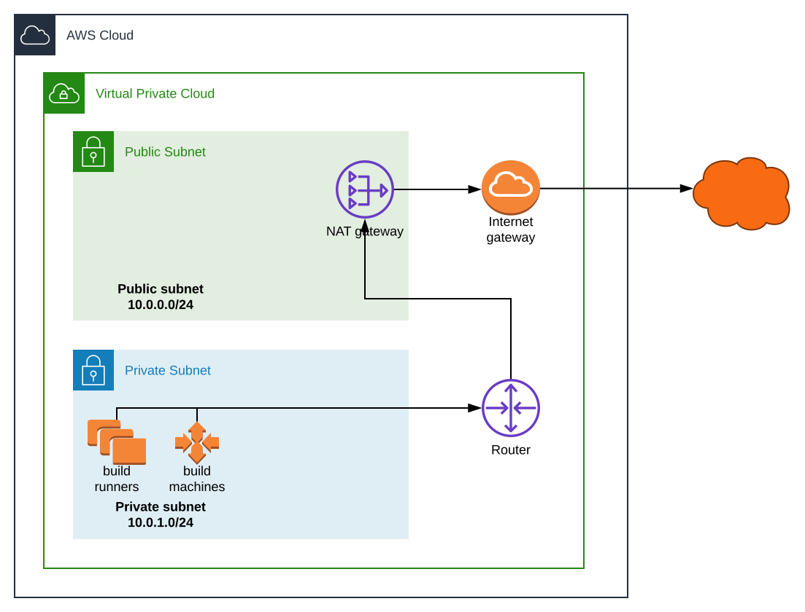

# Autoscaling gitlab runners in AWS
> Ansible playbook to configure a VPC in AWS that hosts
gitlab runners and autoscaling docker workers.

Ansible scripts to configure a virtual private cloud in Amazon Web Services
for software development and deployment.

### Features
* Provision a VPC with public and private subnets.
* Provision an EC2 server and configure as a gitlab runner.
* Provision a gitlab-runner that will automatically spawn and destroy
workers on-demand.
* Register a newly provisioned gitlab runner with your gitlab cloud account.
* Deploy docker credentials to allow your runner to use private docker images (optional).
* Create an s3 bucket for storing artifacts and cache.
* Example source code that may be used with the gitlab runner. See [creatoreng/gitlab-aws-docker-autoscale-example](https://github.com/creatoreng/gitlab-aws-docker-autoscale-example)

### Security features
* gitlab runner defaults to the public subnet with a public IP address,
but can optionally be configured to run in the private subnet by setting
the variable `gitlab_runner_private_address_only` to `true`.
* gitlab runner executes from within a Docker container.
* docker-machine communication between server and workers is TLS encrypted.

### Disclaimer
This repository is a simplification of our production environment. We tested
that it stands up a hello-world build system. We hope that your application will
work by just modifying the configuration variables; but really, think of this
more as a template. Fork it, tweak it, break it, build it. We don't maintain it.

# Overview

### Gitlab CI/CD
Gitlab is a version control, issue tracking and continuous integration /
continuous development tool for software developers.

This template is a generalization of our robotics CI/CD workflow. We manually
configured a project in Gitlab to mirror our code repository in
Github. Webhooks, also manually configured, send events to Gitlab when code
is pushed or on creation of a pull request. Gitlab reads a configuration file
from the source code repository, `.gitlab-ci.yml`,
to determine the build pipeline jobs to execute, and whether
or not the jobs should be run based on certain conditions such as branch or
commit message. Gitlab communicates a 'status check' back to Github to indicate
whether a branch or pull request passed build and tests, allowing Github
to protect a branch against merge/pull requests that fail build or tests.

A gitlab _runner_ is a persistent server that waits for a signal from Gitlab to
begin a build. The gitlab runner then spawns new, powerful on-demand compute
instances to run the build. When the build is complete, the expensive on-demand
build machines terminate, and the runner persists to wait for the next build.

Gitlab has very similar functionality to Github with respect to version control
and issue tracking. The key advantage of Gitlab is that it supports
enterprise-hosted custom autoscaling build servers, whereas Github's action
support is in its infancy. Github is moving fast with their action services in
Azure and when more feature complete it is an attractive alternative to Gitlab.

The Ansible scripts in this repository provision persistent servers in Amazon
EC2 and register them as runners with Gitlab. The runners themselves are
lightweight and run on inexpensive instances.

Gitlab autoscaling runners use _docker-machine_ to spawn new EC2 build machines
on-demand. These instances can be as powerful as you want, with CPU and
and memory resources that fit your needs. As more developers spawn builds
manually, through pull requests, or keywords in commit messages, the Gitlab
autoscale runner spawns new build machines in EC2. This allows multiple
developers to leverage cloud building without waiting in a queue. After a
build machine has been idle for a while, it automatically terminates.

### VPC topology
The VPC is configured with public and private subnets. The public subnet
allows servers with public IP address that can be accessed
directly from the internet. The private subnet hosts services that do not have
public IP addresses and are not directly accessible from the internet. Services
in the private subnet are accessible only from within the subnet (unless
service-specific routing is added).

We recommend configuring a third subnet for VPN, allowing users secure access
to the VPC. The VPN subnet would be configured for client VPN and/or
site-to-site VPN clients to join the VPC. If you have client or site-to-site
VPN access to your VPC, then your gitlab runner can reside entirely in the
private subnet.



# Install Provisioning Tools on your Machine

### Prerequesites
* Ubuntu 18.04 or later
* python3 installed as default interpreter, or you will need to modify the steps
below to invoke python3 for Ansible commands
* Your own AWS access keys and secrets with permissions to provision a VPC
* A gitlab cloud account and runner registration key.

### Install the latest Ansible
```sh
sudo apt-get install software-properties-common
sudo apt-add-repository --yes --update ppa:ansible/ansible
sudo apt-get install ansible
```

### Install libraries needed by Ansible modules invoked in this repository
```sh
sudo apt-get install --upgrade virtualenv python3-pip python3-setuptools
pip3 install --upgrade boto3 boto botocore
```

### Install AWS-CLI, used by Ansible to configure some services
```sh
cd /tmp
wget https://awscli.amazonaws.com/awscli-exe-linux-x86_64.zip
unzip awscli-exe-linux-x86_64.zip
sudo ./aws/install
rm -rf awscli-exe-linux-x86_64.zip ./aws
```

### Install (or update) ansible roles used by these playbooks:
```sh
ansible-galaxy install -r requirements.yml -f -v
```

# Configure for your environment

### AWS keys
Access keys for AWS allow Ansible to provision the VPC. Create the file
`host_vars/localhost/secret-aws.yml`
and populate it with the following variables:
* `aws_access_key: "AAAAA..."`
* `aws_secret_key: "AAAAA..."`

### Gitlab runner registration token
Runner registration token for your gitlab account
allows Ansible to register a newly created runner. Create the file
`group_vars/gitlab_runners/secret-gitlab.yml`
and populate it with the following variable:
* `gitlab_runner_registration_token: "AAAAA..."`

### VPC identifiers
If you have already configured a VPC, populate the following identifiers
in `host_vars/localhost/aws-vpc.yml`:
- `vpc.id`
- `subnet_public.id`
- `subnet_private.id`
- `s3_artifact_bucket`

If you are configuring a VPC from scratch, the VPC identifiers
are output at the end of `playbook-vpc.yml`. Run the script
and then store the output in the above variables.

### Generate an SSH keypair
Generate an SSH keypair for the EC2 server that will
host your gitlab runner. From the root directory of this repo, run
```sh
ssh-keygen -f files/gitlab-runner-ssh
```

The following two files should be generated.
Verify the filenames match, as they are used by
the ansible inventory.
`files/gitlab-runner-ssh`
`files/gitlab-runner-ssh.pub`

### Optional: Configure docker hub authentication
Set your docker hub authorization key to allow
gitlab machines to pull images from your private docker repos.
To use this, create the file `group_vars/gitlab_runners/secret-docker.yml`
and in that file set the variable `docker_auth_key` to the value of your
auth key.

You can find your docker auth key by logging into your docker hub account
via `docker login`, then print the docker config for your user,
```sh
cat ~/.docker/config.json
```

The value for the key `auth` is the value to store in
the variable `docker_auth_key`.

# Provision
The Ansible scripts in this repository are idempotent. Most may be safely
run while cloud services are running, though services may be briefly
interrupted for service or operating system restarts.

### Provision your VPC
The first playbook provisions your VPC. Skip if you have
already configured a VPC.
```sh
ansible-playbook -i inventory.yml playbook-vpc.yml
```

If you haven't yet set the VPC identifiers in
`group_vars/all/aws-vpc.yml`, do so now.

### Provision the EC2 instance that will host the gitlab runner
The second playbook provisions gitlab-specific configuration
and servers in the VPC.
```sh
ansible-playbook -i inventory.yml playbook-gitlab-ec2.yml
```

The last step of the playbook is to output the IP address of the
EC2 instance that hosts your gitlab runner. Open `inventory.yml`
and update the IP address for the gitlab runner to match the EC2
instance that was just created.

### Install & configure the gitlab runner
The third and final playbook configures a gitlab runner that will
persist on the EC2 instance created by the previous playbook.

Be sure to update `inventory.yml` with the IP address of the EC2
instance prior to running this playbook, or it will fail to connect.

```sh
ansible-playbook -i inventory.yml playbook-gitlab-runner.yml
```

Upon successful playbook completion, a gitlab runner will be running
on your EC2 instance in a docker container, and will have registered
itself with your gitlab cloud instance.

# Configure your Project Repository and Build
### Configure Gitlab
If you got this far, you have persistent runners in EC2 registered with
your Gitlab project and capable of spawning docker-machine workers.
Well done. It's up to you to configure and run your pipeline. The following
manual steps complete the pipeline:
* Create a Gitlab project to host your code repo (or mirror Github) for CI/CD
* Add webhooks in Github to trigger pipeline builds
* Configure `.gitlab-ci.yml` in the code repository
* See: [Autoscaling GitLab Runner on AWS EC2](https://docs.gitlab.com/runner/configuration/runner_autoscale_aws/)

### Test with a sample repository
Clone [creatoreng/gitlab-aws-docker-autoscale-example](https://github.com/creatoreng/gitlab-aws-docker-autoscale-example)
for a simple example of a gitlab pipeline configuration that utilizes
the services that have now been configured in your VPC.

# Debuging

### gitlab runner SSH access
Use the SSH keypair you generated earlier to SSH into the EC2 instance:
```sh
ssh -i files/gitlab-runner-ssh ubuntu@[host IP address from inventory]
```

### gitlab-runner log
On the gitlab-runner instance, tail the gitlab-runner log:
```sh
docker logs -f gitlab-runner
```

### docker-machine SSH access
The autoscale build machines spawned by the gitlab-runner automatically generate
SSH keypairs which are stored in the EC2 instance. To investigate docker
machines, first query the docker machine service on the autoscale gitlab runner:
```sh
docker-machine ls
```

Gitlab web console shows the build output of runners and machines, which is
usually sufficient for debugging a build failure. If for some reason you need to
access the build machine directly, first find the hostname of the docker
machine and then use the docker-machine SSH command on the runner to use the
automatically generated keypair to start an SSH session.

> Here be dragons, if you're doing this you're probably doing it wrong: these
are ephemeral build machines that are spawned and terminated on-the-fly. You
should be able to find everything you need from the Gitlab web interface or the
logs of the gitlab-runner that spawned the machine.

```sh
docker-machine ls
docker-machine ssh [machine identifier from previous command]
```

### Gitlab metrics and session servers
Gitlab runners start HTTP servers to report on build metrics and
to provide a real-time 'debug' (terminal) console to running machines. Gitlab
cloud assumes these servers are available on public IP addresses.

If your runners don't have public IP addresses, the debug and session servers
aren't accessible from the Gitlab project website.

The metrics server should work for any clients within the VPC. The session
server requires information about the job and a session key, which may require
a proxy relay from Gitlab cloud; this is left as future work.

# References
### AWS
* devops-recipes: [Provision Amazon Web Services VPC using Ansible](https://github.com/devops-recipes/prov_aws_vpc_ansible	)
* AWS: [Best practices for managing AWS access keys](https://docs.aws.amazon.com/general/latest/gr/aws-access-keys-best-practices.html)
* [Introducing AWS Client VPN to Securely Access AWS and On-Premises Resources
](https://aws.amazon.com/blogs/networking-and-content-delivery/introducing-aws-client-vpn-to-securely-access-aws-and-on-premises-resources/)
* [VPC with public and private subnets and AWS Site-to-Site VPN access](https://docs.aws.amazon.com/vpc/latest/userguide/VPC_Scenario3.html)
* [Centralized DNS management of hybrid cloud with Amazon Route 53 and AWS Transit Gateway](https://aws.amazon.com/blogs/networking-and-content-delivery/centralized-dns-management-of-hybrid-cloud-with-amazon-route-53-and-aws-transit-gateway/)

### Gitlab
* Gitlab: [Autoscaling GitLab Runner on AWS EC2](https://docs.gitlab.com/runner/configuration/runner_autoscale_aws/)
* Gitlab: [Installing GitLab on Amazon Web Services (AWS)](https://docs.gitlab.com/ee/install/aws/#creating-an-iam-ec2-instance-role-and-profile)
* jtyr: [Ansible playbook to install a docker gitlab runner](https://github.com/jtyr/ansible-docker_gitlab_runner)
* Hackernoon: [Configuring GitLab CI on AWS EC2 Using Docker](https://hackernoon.com/configuring-gitlab-ci-on-aws-ec2-using-docker-7c359d513a46)
* Lothat Shulz: [GitHub Action Self Hosted Runners on AWS (incl. Spot instances)](https://www.lotharschulz.info/2019/12/09/github-action-self-hosted-runners-on-aws-incl-spot-instances/)
* riemers: [Ansible role to install gitlab runner](https://github.com/riemers/ansible-gitlab-runner)
* DataBiosphere: [Gitlab CI Autoscaling Setup](https://github.com/DataBiosphere/toil/wiki/Gitlab-CI-Autoscaling-Setup)
* GhostLyrics: [http://ghostlyrics.net/building-and-deploying-a-c-library-with-gitlab.html](http://ghostlyrics.net/building-and-deploying-a-c-library-with-gitlab.html)
